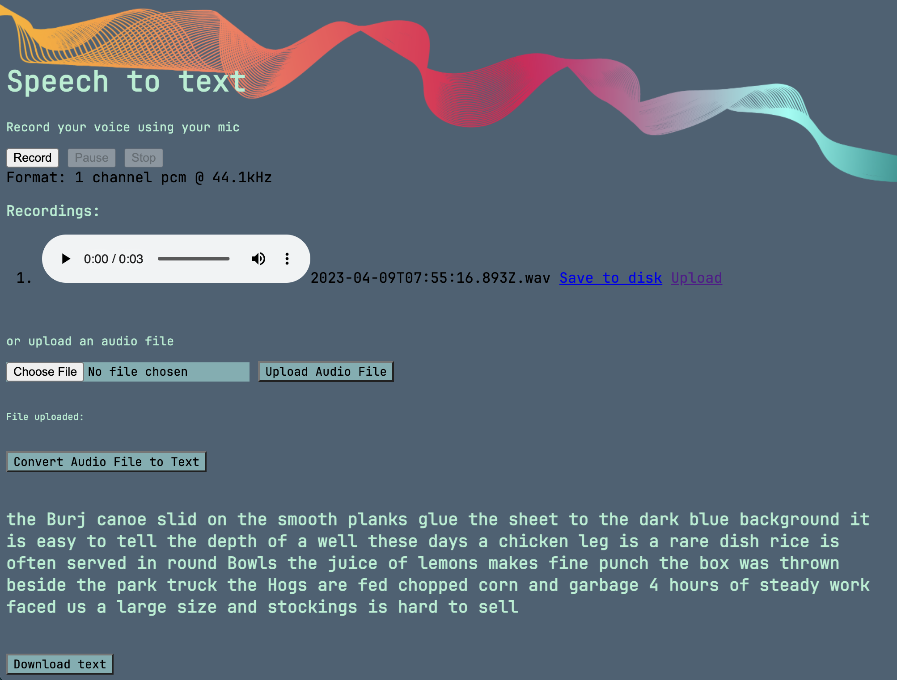

# Speech to Text Converter
The Speech to Text Converter is a Flask-based web application that transcribes audio into text using Google’s Speech Recognition API. Users can record audio via their microphone or upload a WAV file, select a language (English, Spanish, French, German), and download the transcribed text. The application features a simple, responsive interface with a background image and custom styling.


## ✨ Features

- Audio Recording: Record audio directly using your microphone with start, pause, and stop controls.
- File Upload: Upload WAV audio files for transcription.
- Language Selection: Supports multiple languages (English, Spanish, French, German).
- Transcription: Converts audio to text using Google Speech Recognition.
- Downloadable Output: Download the transcribed text as a .txt file.
- Responsive Design: Mobile-friendly interface with custom fonts and styling.


## 🔧 Prerequisites
Ensure you have the following installed:

- Python 3.11 or higher
- Git
- Code editor (e.g., VS Code)
- A modern web browser (e.g., Chrome, Firefox) with microphone access
- Optional: A server environment (e.g., Apache with WSGI) for deployment


## 🚀 Setup Instructions
1. Clone the Repository

```console
git clone https://github.com/your-username/speech-text-main.git
cd speech-text-main
```
2. Create a Virtual Environment
```console
python3 -m venv venv
```
Activate the environment:

Linux/macOS:
```console
source venv/bin/activate
```

Windows:
```console
venv\Scripts\activate.bat
```


3. Install Dependencies
  Install the required Python packages:
```console
pip install -r requirements.txt
```
4. Configure Environment Variables
Create a .env file in the root directory (not tracked, per .gitignore):
```console
cp .env.example .env
```
Edit .env with your Flask secret key:
```console
FLASK_SECRET_KEY=your_secret_key
```
5. Run the Application
Start the Flask development server:
```console
python app.py
```
The application will run on http://localhost:5000.

## 🔑 Configuration

- Flask Secret Key: Set FLASK_SECRET_KEY in .env for secure session management.
- File Paths: The app saves audio files as audio.wav and transcribed text as output.txt in the root directory. These files are deleted after transcription.
- Language Options: The app supports English (en-US), Spanish (es-ES, es-AR), French (fr-FR), and German (de-DE). Modify index.html to add more languages.
- Deployment: For production, use app.wsgi with a WSGI server (e.g., Gunicorn or Apache with mod_wsgi). Update server_path in app.py to the appropriate directory (e.g., /var/- www/html/apps/speech_text/).


## 🏃 Using the Application

- Access the Web Interface:
  - Open http://localhost:5000 in your browser.


- Record or Upload Audio:
  - Record: Click "Record" to start, "Pause" to pause/resume, and "Stop" to finish. After stopping, click "Upload" to send the recording.
  - Upload: Use the file input to upload a WAV audio file and click "Upload".


- Select Language:
  - Choose a language (English, Spanish, French, German) from the dropdown.


- Transcribe:
  - Click "CONVERT SPEECH > TEXT" to start transcription.
  - The app will redirect to a processing page while transcribing.


- View and Download:
  - Once completed, view the transcribed text on the result page.
  - Click "Download text" to download the transcription as output.txt.
  - Click "Try again!" to return to the main page.


## 🛠️ Troubleshooting

- Microphone Access:
  - Ensure your browser has permission to access the microphone.
  - Test recording in a supported browser (Chrome, Firefox).


- File Upload Errors:
  - Confirm the uploaded file is a valid WAV file.
  - Check write permissions in the directory for saving audio.wav and output.txt.


- Transcription Errors:
  - UnknownValueError: The audio may be unclear. Try speaking clearly or uploading a better-quality file.
  - RequestError: Ensure you have an internet connection, as Google Speech Recognition requires online access.


- Dependencies:
  - Verify Python 3.11+ is used and re-run pip install -r requirements.txt.
  - If microphone recording fails, you may need to install pyaudio (pip install pyaudio).


- CORS Issues:
  - If deploying on a server, ensure the server allows CORS for audio uploads.


- Logs:
  - Check the Flask console output for errors (debug mode is enabled by default).


## 🤝 Contributing
Contributions are welcome! To contribute:

- Fork the repository.

- Create a feature branch:
```console

git checkout -b feature/your-feature
```

- Commit changes:
```console

git commit -m "Add your feature"
```

- Push to the branch:
```console

git push origin feature/your-feature
```

- Open a pull request.


  Please follow the Code of Conduct (if available).

## 📜 License
This project is licensed under the MIT License. See the LICENSE file for details.

⭐ Star this repo if you find it useful!📩 For questions, open an issue or contact the maintainers.
